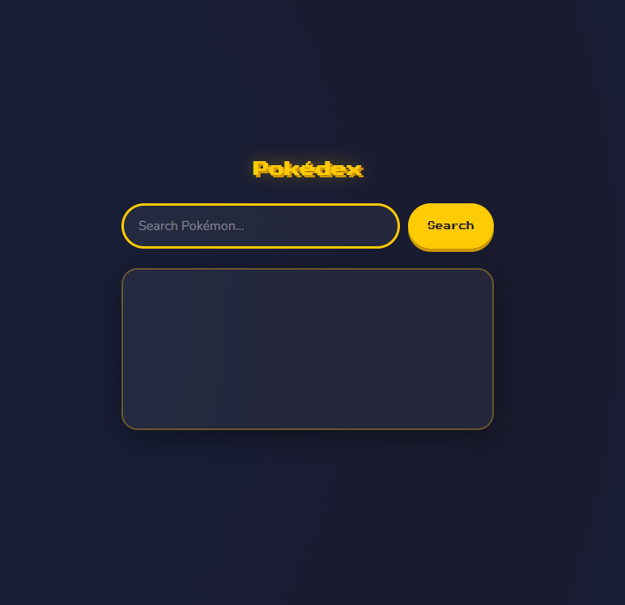

# 🔴 Pokédex

A clean, responsive Pokédex web app built with vanilla HTML, CSS and JavaScript. Search any Pokémon by name or ID and instantly get their stats, types, abilities and more.

## ✨ Features

- Search by Pokémon name or ID number
- Displays sprite, types, stats, abilities, height, weight and base experience
- Error handling for unknown Pokémon names
- Works with keyboard (press Enter to search)
- Fully responsive — works on mobile
- Pokémon-themed design with pixel font and dark theme

## 🛠️ Built With

- HTML5
- CSS3 (Flexbox, CSS Variables, media queries)
- Vanilla JavaScript (Fetch API, DOM manipulation)
- [PokéAPI](https://pokeapi.co/) — free, open Pokémon data API

## 🚀 Live Demo

[View on GitHub Pages](https://CountKrakula.github.io/pokedex)

## 📸 Preview



## 🏁 Getting Started

Just clone the repo and open `index.html` in your browser — no dependencies or build tools needed.

```bash
git clone https://github.com/your-username/pokedex.git
cd pokedex
open index.html
```

## 📝 License

MIT
